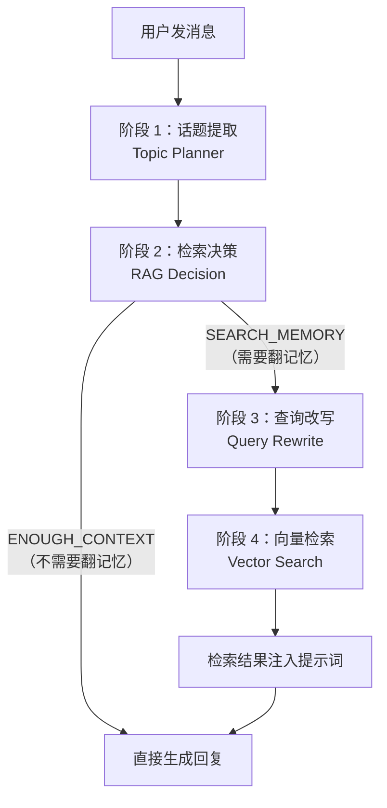
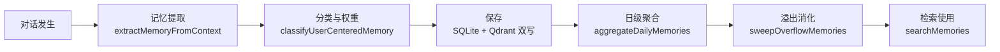
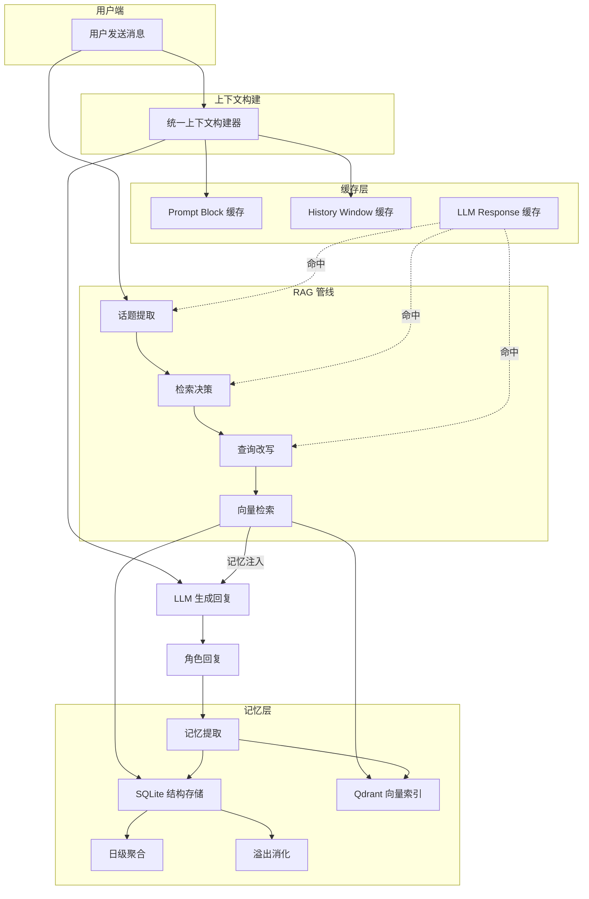

# ChatPulse 技术科普：缓存、RAG 与记忆系统

> **阅读门槛**：零基础友好。本文用生活类比解释 ChatPulse 的三大核心技术——多层缓存、RAG 检索增强生成、以及基于向量数据库的长期记忆。

---

## 一、项目是什么？一句话版本

ChatPulse 是一个 **AI 角色社交模拟平台**。  
跟普通 AI 聊天机器人最大的区别是：这里的角色"活着"——它们会记住你说过的话、有情绪波动、会自己去上班吃饭逛街、会在你没理它的时候主动给你发消息。

| 功能 | 类比 |
|------|------|
| 私聊 | 微信一对一 |
| 群聊 | 微信群 |
| 朋友圈 | 发动态、点赞、评论 |
| 城市模拟 | 角色有自己的生活作息 |
| 长期记忆 | 角色"记得你" |

技术栈：React 19 前端 + Node.js/Express 后端 + SQLite 数据库 + Qdrant 向量搜索引擎 + WebSocket 实时通信。

---

## 二、缓存系统：不做重复劳动的"备忘录"

### 为什么需要缓存？

每次角色跟你说话，系统需要：
1. 把角色的人设、世界观、行为准则拼成一大段"系统提示词"
2. 把最近的聊天记录格式化
3. 调 LLM（大语言模型）生成回复

**问题**：第 1 步和第 2 步的大部分内容，连续几轮对话里几乎不变——角色人设不会每秒都改。每次都重新算一遍，就像每天上班都重新画一张公司地图，根本没必要。

### 三层缓存架构

ChatPulse 搭了**三层缓存**来解决这个问题：

```
┌─────────────────────────────────────────────┐
│  第 1 层：Prompt Block 缓存                  │
│  对象：角色人设、行为准则、情绪/身体状态描述      │
│  原理：把源数据做 SHA-256 哈希 → 命中则跳过编译  │
│  位置：engine.js getCachedPromptBlock()       │
│         contextBuilder.js getCachedContextBlock() │
└─────────────────────────────────────────────┘
        │
        ▼
┌─────────────────────────────────────────────┐
│  第 2 层：History Window 缓存                │
│  对象：聊天记录 → LLM 消息格式 的转换结果        │
│  原理：滑动窗口对比，重叠部分直接继承旧编译       │
│  位置：engine.js buildSlidingHistoryWindow()  │
└─────────────────────────────────────────────┘
        │
        ▼
┌─────────────────────────────────────────────┐
│  第 3 层：LLM Response 缓存                  │
│  对象：RAG 各阶段的 LLM 调用结果               │
│  原理：相同输入 + 6 小时 TTL 内直接复用          │
│  位置：llm.js callLLM({ enableCache: true })  │
└─────────────────────────────────────────────┘
```

**类比**：
- 第 1 层像"名片夹"——角色信息没变就直接拿旧名片，不重抄。
- 第 2 层像"活页笔记本"——新聊了两句，只翻新的两页，前面的页不重写。
- 第 3 层像"问过的问题存档"——6 小时内问一样的问题，直接拿旧答案。

### 核心原理：哈希校验

```
源数据 (角色人设/聊天记录/LLM 输入)
        │
        ▼
  SHA-256 哈希 → 得到一串指纹
        │
        ├─ 指纹匹配 → 直接返回缓存结果 ✅
        │
        └─ 指纹不匹配 → 重新编译/调用 → 存入缓存 🔄
```

好处：**聊天体验更快、token（调用 LLM 的"货币"）花费更少**。据项目测量，digest+tail 模式配合缓存可节省约 40–50% 的 prompt 长度。

---

## 三、RAG 系统：让角色"回忆"的搜索引擎

### 什么是 RAG？

**RAG = Retrieval-Augmented Generation**，翻译成人话就是：**先搜再答**。

普通 AI 聊天是"有啥说啥"，上下文窗口之外的东西全忘。RAG 就像给 AI 配了一个"备忘录搜索助手"——用户问"你还记得我之前说的那件事吗？"，AI 不是硬猜，而是先去翻笔记找到相关记录，再基于找到的内容回答。

### ChatPulse 的 4 阶段 RAG 管线

ChatPulse 的 RAG 不是简单的关键词搜索，而是一个由 LLM 驱动的**四步智能管线**：



#### 阶段 1：话题提取（Topic Planner）

> 🧠 "用户在聊什么？可能涉及哪些旧话题？"

一个专门的 LLM 调用分析用户的最新消息，推断出最多 5 个潜在的长期记忆话题。  
比如用户说"最近面试怎么样了"，系统可能推断出 `["用户近况", "求职", "工作"]`。

**特别偏好**：用户个人信息、近况、关系相关的话题会被优先识别。

#### 阶段 2：检索决策（RAG Decision）

> 🤔 "需不需要翻旧记忆？"

系统不会每次都去搜——如果最近的对话已经足够回答，就直接跳过检索（输出 `ENOUGH_CONTEXT`）。只有当旧记忆能让回答更准确、更连贯、更私人化时，才触发搜索（输出 `SEARCH_MEMORY`）。

这避免了"每句话都搜一遍记忆"造成的延迟和 token 浪费。

#### 阶段 3：查询改写（Query Rewrite）

> 📝 "把模糊的意图变成精确的搜索指令"

检索决策给出的关键词通常比较粗，这一步把它改写成结构化的 JSON 搜索请求：

```json
{
  "queries": ["用户学历背景", "用户求职近况", "用户面试经历"],
  "filters": {
    "memory_focus": ["user_profile", "user_current_arc"],
    "memory_tier": ["core", "active"]
  },
  "limit": 4
}
```

系统还会自动叠加**硬约束**——检测到用户问"你了解我吗"这类问题，就强制加入 `user_profile` 过滤器，确保不遗漏。

#### 阶段 4：向量检索（Vector Search）

拿着改写后的查询去 Qdrant 向量数据库搜索语义最相近的记忆。找到的记忆会被格式化并注入到系统提示词中，让角色"回忆起来"。

---

## 四、记忆系统：AI 角色的"大脑"

### 双存储架构

ChatPulse 用两个数据库协作实现记忆：

| | SQLite | Qdrant |
|---|---|---|
| **存什么** | 完整记忆数据（结构化字段） | 记忆的向量嵌入（数学指纹） |
| **擅长什么** | 精确查找、排序、过滤 | 语义搜索（"意思相近"的查找）|
| **类比** | 图书馆的书架和目录卡 | 图书馆的"以意搜词"搜索引擎 |

#### 为什么需要两个？

**SQLite** 存的是记忆的"全貌"——事件、时间、人物、情绪、重要度、关系等结构化信息，适合精确查询("给我这个角色的所有核心记忆")。

**Qdrant**（向量数据库）存的是每条记忆的**语义指纹**——一个 1024 维的数字向量。当用户说了一句话，系统把这句话也转成向量，然后在 Qdrant 里找"距离最近"的记忆向量。

```
"你还记得我上次说的那个项目吗？"
        │
        ▼  文本 → 向量（1024 维数字数组）
   [0.12, -0.34, 0.56, 0.78, ...]
        │
        ▼  余弦相似度搜索
   Qdrant 返回最相似的 N 条记忆向量
        │
        ▼  拿向量对应的 ID 去 SQLite 取完整记忆
   "三天前用户分享了一个 React 项目的进展"
```

#### 本地嵌入（不依赖外部 API）

向量是用 `@xenova/transformers` 库在本地生成的（默认使用 BGE-M3 模型，输出 1024 维向量），**不需要调用外部 embedding API**，省钱且快。

### 记忆的生命周期



1. **提取**：每轮对话结束后，系统用 LLM 从对话中提取"值得记住的事"——不是逐句存，是提炼关键信息。
2. **分类**：每条记忆被打上标签：
   - `memory_focus`：`user_profile`（用户信息）/ `user_current_arc`（用户近况）/ `relationship`（关系）/ `general`（一般）
   - `memory_tier`：`core`（核心不变）/ `active`（活跃变化）/ `ambient`（背景氛围）
3. **保存**：同时写入 SQLite（完整数据）和 Qdrant（向量索引）。
4. **聚合**：每天自动把零散记忆合并成日级摘要，防止记忆碎片过多。
5. **溢出消化**：当聊天记录超过窗口上限，超出部分的旧消息会被提炼成记忆再标记为"已消化"，确保信息不丢失。
6. **检索**：上面 RAG 管线的最后一步。

### 对话摘要（Digest + Tail 模式）

这是 ChatPulse 压缩上下文的核心策略：

```
完整聊天（60 条消息）
┌──────────────────────────────────────┐
│  旧消息（被压缩成摘要 → "对话摘要"）     │  ← Digest
│                                      │
│  ──────────────────────              │
│                                      │
│  最近几条消息（保持原文）               │  ← Tail
└──────────────────────────────────────┘
```

- **Digest**（摘要）：旧的大量消息被 LLM 压缩成一段简短摘要，放在系统提示词里。
- **Tail**（尾部原文）：最近的几条消息保持原文不丢，确保 AI 能看到当前对话的精确内容。

结果：prompt 长度缩短了约 **40–50%**，但 AI 既知道"之前聊了什么大概内容"，又能精确看到"刚刚说了什么"。

### 记忆检索的评分机制

搜索记忆不是简单的"最相似就赢"。系统会给每条候选记忆叠加多种加权：

| 加分/扣分 | 说明 |
|-----------|------|
| 向量相似度 | 语义越相近，底分越高 |
| 记忆权重 | `core` 记忆有 tier 加成 |
| 用户画像优先 | `user_profile` / `user_current_arc` 类型的记忆在相关查询中获得额外加分 |
| 词汇匹配加成 | 如果记忆文本里直接包含查询关键词，额外加分 |
| 别名桥接 | 中英双语别名匹配（如"工作" ↔ "work"） |
| 矛盾惩罚 | 检测潜在矛盾信息并降权 |
| 去重 | 相同 character+event+focus 的记忆去重，只留最高分 |

### 降级策略

如果 Qdrant 向量数据库不可用（比如没装 Docker），系统会自动降级：

```
Qdrant 可用？ ──┬── 是 → 向量语义搜索（最佳）
               └── 否 → 本地 Vectra 索引 + SQLite 词汇匹配降级
```

这意味着即使不装 Qdrant，记忆功能也能用，只是搜索质量略低。

---

## 五、统一上下文构建器：把一切粘在一起

`contextBuilder.js` 是所有 AI 交互的"信息集散中心"。不管是私聊、群聊还是城市模拟，角色回话前都会经过这个模块，拿到一份统一的"世界状态简报"：

```
统一上下文 = 
    当前时间 + 时间行为约束
  + 身体状态（精力/睡眠/饱腹/体力/健康）
  + 情绪状态 + 压力等级
  + 城市生活场景（工作中/休息中/饿了...）
  + 钱包余额 + 体力百分比
  + 嫉妒状态 + 被冷落记录
  + 关系锚点（对其他角色的好感和印象）
  + 朋友圈上下文
  + 跨场景注入（群聊↔私聊互相看到对方的内容）
  + 商业街生活记录
  + 检索到的长期记忆
```

这就保证了角色在不同场景里表现一致——在城市里打完工觉得累，回来私聊时也会带着疲惫感。

---

## 六、总结：一张架构全景图



**核心设计理念**：

1. **不浪费** — 多层缓存避免重复计算和 API 调用
2. **不健忘** — 双存储 + 向量搜索让角色真的"记得你"
3. **不死板** — RAG 管线按需检索，不是每句话都翻旧账
4. **不割裂** — 统一上下文保证角色在所有场景下表现一致

这也是 ChatPulse 区别于大多数 AI 聊天应用的核心原因：**角色不是一个无状态的对话框，而是一个有记忆、有情绪、有生活的持续存在。**
